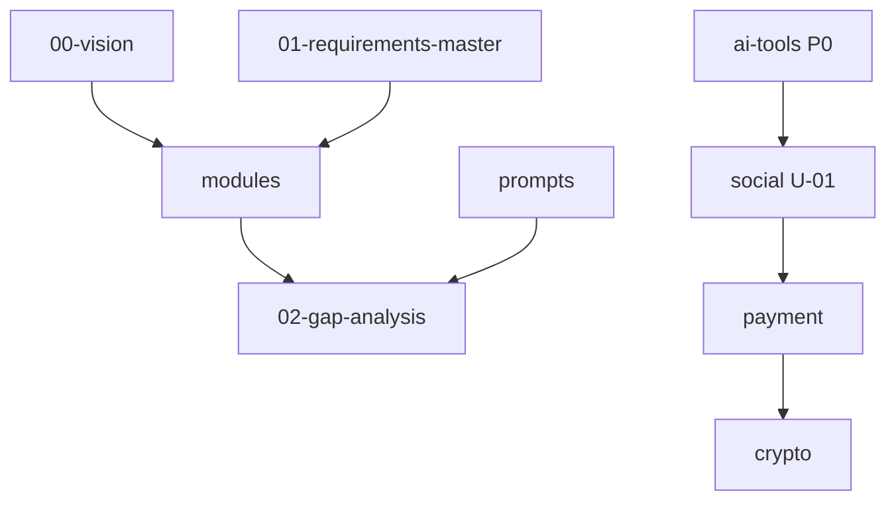

# 文件索引

> 自動生成维护 | 2026-07-18

## docs/

| 文件 | 用途 | 狀態 |
|------|------|------|
| [00-vision.md](docs/00-vision.md) | 願景、優先級、成功指標 | draft |
| [01-requirements-master.md](docs/01-requirements-master.md) | 跨模組總需求 | draft |
| [02-gap-analysis.md](docs/02-gap-analysis.md) | **缺口分析（核心）** | draft |

## modules/

| 文件 | 優先級 | 狀態 | 完成度估 |
|------|--------|------|----------|
| [ai-tools-directory.md](modules/ai-tools-directory.md) | P0 | draft | ~25% |
| [social-platform.md](modules/social-platform.md) | P1 | draft | ~10% |
| [payment-service.md](modules/payment-service.md) | P2 | draft | ~10% |
| [crypto-trading.md](modules/crypto-trading.md) | P3 | draft | ~10% |

## prompts/

| 文件 | 用途 |
|------|------|
| [AGENT-MASTER.md](prompts/AGENT-MASTER.md) | Agent 主角色 |
| [review-gap.md](prompts/review-gap.md) | 缺口審查 |
| [auto-update.md](prompts/auto-update.md) | 自動更新規格 |

## templates/

| 文件 | 用途 |
|------|------|
| [module-spec.md](templates/module-spec.md) | 新模組模板 |
| [tool-entry.md](templates/tool-entry.md) | 單一 AI 工具条目 |

## content/

| 路径 | 用途 | 狀態 |
|------|------|------|
| [content/tools/](content/tools/) | AI 工具 MD 資料 | 空（待填） |

## web/

| 文件 | 說明 |
|------|------|
| [web/index.html](web/index.html) | AI 工具搜尋原型主頁 |
| [web/data.js](web/data.js) | 24 個工具資料 |
| [web/script.js](web/script.js) | 搜尋邏輯 |
| [web/style.css](web/style.css) | 樣式 |

## 依賴關係（簡圖）

