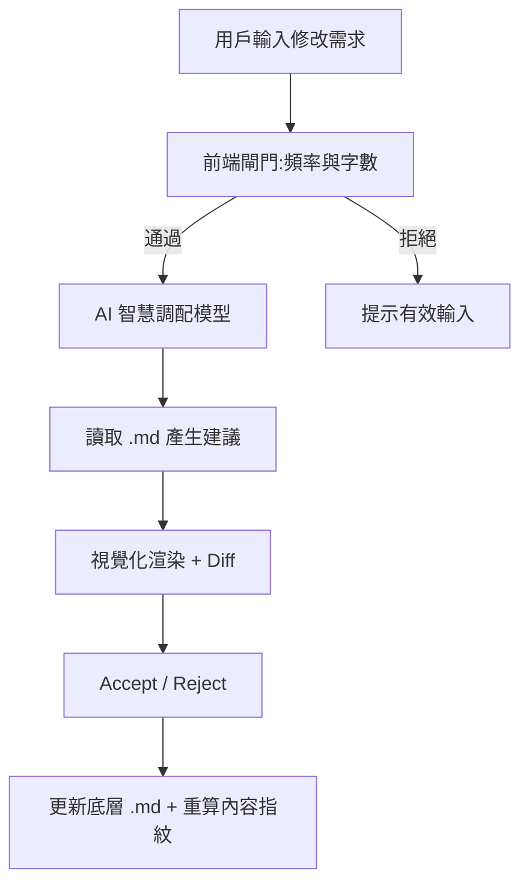
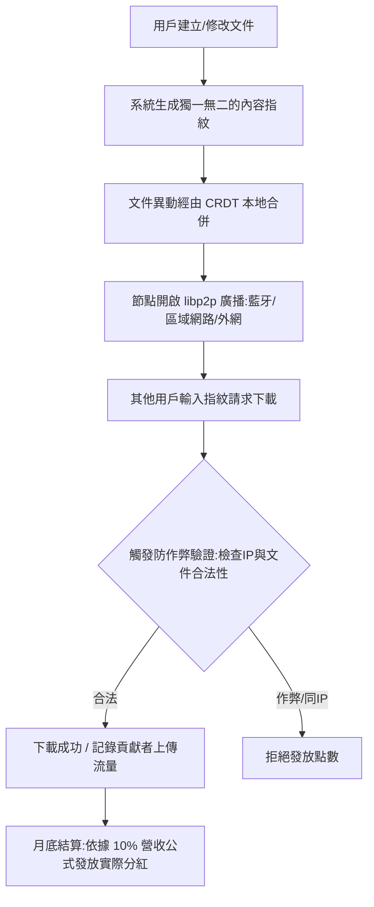

# SmartDoc — AI 資料收集／編修工具規格

> **這不是子專案**，只是 SEED 平台上**一類 AI 資料收集工具**（編修 Markdown、協助產出知識書）。  
> 其他類型還有「AI 查詢目錄」等；程式碼放在 `smartdoc-ai/` 只是資料夾，不是獨立產品邊界。  
> 北極星：[`00-seed-platform.md`](./00-seed-platform.md) · 驗收：[`03-checklist.md`](./03-checklist.md) · 對話入檔：[`01-idea.md`](./01-idea.md)

> **工具願景（雙軸）**  
> 1. **SmartDoc AI**：「Word 界的 Cursor」——對話式修訂與視覺化 Diff。  
> 2. **SmartDoc P2P**：斷網仍可協作；內容定址與節點貢獻服務「傳書」，服從 SEED 主線。  
> **注意**：產品語言的 **SEED（知識書）** ≠ 實作裡的內容雜湊 id（`sd_…` edition fingerprint）。

---

## 1. 核心技術架構

### 1.1 共通底層

* **唯一儲存格式**：全系統採用 **Markdown (`.md`)** — 輕量、省 Token、利於低頻寬傳輸與 AI 讀寫。
* **資料與視覺分離**：同一份 `.md` 可切換多種 Render Mode（合約／流程圖／商用報告）。

### 1.2 AI 協作層

* 右側 AI Sidebar：直白中文指令、`@章節` Mention。
* 模型智慧調配：日常 → 平價模型；深度審查 → 頂級模型（Pro 深度分析月上限 50 次）。
* 前端閘門：字數 < 2 不觸發 API；5 秒內不可連續發送。

### 1.3 去中心化層（P2P）

* **Local-First**：資料預設完整存於本地，不依賴中央雲端。
* **內容定址**：每個檔案／異動生成加密雜湊（畫面常稱 Seed／`sd_…`）；持有指紋即可在 P2P 網尋址下載。
* **多重網路融合 (libp2p 概念)**：
  1. **LAN**：同一台無外網 Wi-Fi 分享器互傳
  2. **Hotspot**：手機熱點互連同步
  3. **Wi-Fi Direct / 藍牙**：約 10 公尺內點對點握手
* **CRDT 無衝突合併**：離線各自修改不同段落，連線碰頭時自動融合（目標技術：Yjs / Automerge）。

---

## 2. 核心功能規格 (MVP)

### 功能 A：多模式渲染

* **合約模式**：A4、新細明體風格、法條縮排、條目導覽
* **流程圖模式**：Mermaid 互動圖表
* **商用報告模式**：黑體、標題底條、網格表格

### 功能 B：視覺化追蹤修訂 (Visual Diff)

* 刪除：紅底 + 刪除線；新增：綠底 + 底線
* `[接受 Accept]` / `[拒絕 Reject]` → 更新底層 `.md`
* 適用於 AI 建議與 P2P 離線協作匯入

### 功能 C：AI 協作對話框

* 右側常駐；支援 Mention；Freemium 額度控制

### 功能 D：P2P 與離線合併

* 文件變更即重算內容指紋，可複製分享
* 模擬 LAN / Hotspot / Bluetooth 傳輸通道
* 離線分支編輯後以 CRDT 風格合併，並以 Diff 呈現
* 下載請求走防作弊驗證後才發放貢獻點數

---

## 3. 商業模式

### 3.1 AI 訂閱（心甘情願策略）

1. **免費**：完整渲染 + 紅綠 Accept；每月 15 次 AI 對話
2. **按量**：`NT$30 / 50 次對話`
3. **Pro / Premium**：NT$290–490／月（或 NT$600）；無限 AI + Word (`.docx`) 匯出

### 3.2 去中心化任務經濟（Tokenomics）

平台撥出**總營收的 10%** 作為貢獻者獎金池。

設當月營收 $R$，分紅總額 $A = R \times 10\%$。  
全網任務總點數 $P_{total}$，則每點價值：

$$V_{point} = \frac{A}{P_{total}}$$

**點數來源**

* 在線空間貢獻：自願連線提供路由尋址
* 有效上傳流量：他機以內容指紋從你裝置下載真實檔案

**Anti-Cheat**

1. Input Validation：字數過少／無效字元不計
2. Rate Limiting & IP/LAN Check：禁止同 LAN／同 IP 互刷下載
3. 合法文件驗證：僅平台簽章認證之真實用戶文件流量才計點

---

## 4. 操作流程

### 4.1 AI 修訂流程

### 4.2 P2P 與分紅流程

---

## 5. 實作邊界（目前 demo）

| 項目 | 狀態 |
|------|------|
| 多模式渲染 + Visual Diff + AI Sidebar | ✅ 已實作（AI 為規則引擎示範） |
| 內容定址 + Local-First 儲存 | ✅ 瀏覽器 Web Crypto + localStorage |
| CRDT 離線合併 | ✅ 段落級合併示範（正式版接 Yjs/Automerge） |
| libp2p 實體傳輸 | 🟡 UI／協定模擬（LAN/Hotspot/BT） |
| 真實藍牙／Wi-Fi Direct | ⏳ 原生殼層或 Web API 後續 |
| 分紅金流出款 | 🟡 點數帳本與公式模擬 |

驗收勾選以 [`03-checklist.md`](./03-checklist.md) 為準。
