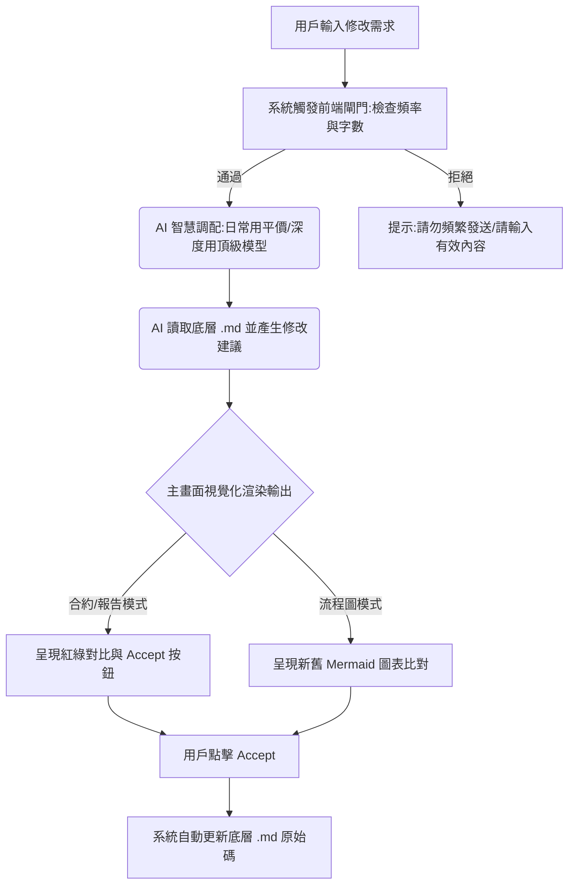

# SmartDoc AI — 產品需求文件 (PRD)

> **產品願景**：打造一個「Word 界的 Cursor」，讓不懂程式碼的一般商務用戶（法務、祕書、研究生、行政人員），能透過與 AI 頻繁對話，在精美的排版畫面上直覺、安全地修改、追蹤與渲染各種類型的文件。

---

## 1. 核心技術架構與概念

* **底層格式**：全系統統一採用 **Markdown (`.md`)** 作為唯一儲存格式。好處是輕量、省 Token，且 AI 讀寫極度流暢。
* **資料與視覺分離**：同一份 `.md` 原始文字檔案，系統可根據用戶需求，切換不同的「檢視渲染模式（Render Mode）」，自動套用對應的樣式與排版。

---

## 2. 核心功能規格 (MVP 階段)

### 功能 A：多模式渲染切換 (Multi-View Render)

* **合約模式 (Legal Contract View)**：A4 比例、新細明體風格、標準法條縮排、右側／側邊條目導覽列。
* **流程圖模式 (Diagram View)**：將 `.md` 內嵌的 `Mermaid` 語法渲染成可互動圖表。
* **商用報告模式 (Business Report View)**：現代化黑體、科技感標題底條、網格化表格。

### 功能 B：視覺化追蹤修訂 (Visual Diff & Accept)

* **刪除內容**：紅色背景 + 刪除線。
* **新增內容**：綠色背景 + 底線。
* **操作互動**：`[接受 Accept]` / `[拒絕 Reject]`，更新底層 `.md`。

### 功能 C：AI 協作對話框 (AI Sidebar Chat)

* 右側常駐 AI 對話面板，支援直白中文指令。
* 支援 `@章節` Mention。

---

## 3. 商業收費模式

1. **免費體驗（Freemium）**：完整渲染 + 紅綠 Accept；每月 15 次 AI 對話。
2. **按量付費**：`NT$30 / 50 次對話`。
3. **Pro / Premium**：每月 NT$290–490（或 NT$600）；無限 AI + Word (`.docx`) 匯出。

---

## 4. 後台算力與安全控制

### 模型降級

* 日常任務 → Gemini Flash / GPT-4o-mini
* 深度任務 → Claude 3.5 Sonnet（Pro 每月上限 50 次深度分析）

### 前端閘門

* Input Validation：少於 2 字不觸發 API
* Rate Limiting：5 秒內不可連續發送

---

## 5. 操作流程

